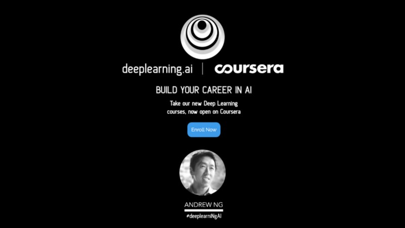

<!--- These are examples. See https://shields.io for others or to customize this set of shields. You might want to include dependencies, project status and licence info here --->

<a class="LI-simple-link" href='https://www.linkedin.com/in/problem-solver-nabeel-ahmed/-13138490?trk=profile-badge'>Nabeel Ahmed</a>

---

A series of online courses offered by [deeplearning.ai](https://www.deeplearning.ai/). I would like to say thanks to Prof. [**Andrew Ng**](www.andrewng.org) and his colleagues for spreading knowledge to normal people and great courses sincerely. This course laid a path for ML & DL enthusiast to follow.

### Note

---

This repository is created as a reference to go to in future for academic related work. Feel Free to make use of this repository while you are doing Deep Learning specialization.

**Please only use it as a reference**. The quiz and assignments are relatively easy to answer, hope you can have fun with the courses.

### 1. Neural Network and Deep Learning

_ [Course 1](https://github.com/Nabeel110/Deep-Learning-Specialization/tree/master/Course%201)
 
- Week 2
  _ [Python Basics with Numpy](https://github.com/Nabeel110/Deep-Learning-Specialization/blob/master/Course%201/Week%202/Python_Basics_With_Numpy_v3a.ipynb)
  _ [Logistic Regression with Neural Network](https://github.com/Nabeel110/Deep-Learning-Specialization/blob/master/Course%201/Week%202/Logistic_Regression_with_a_Neural_Network_mindset_v6a.ipynb)
  _ [Gradient Checking](https://github.com/Nabeel110/Deep-Learning-Specialization/blob/master/Course%201/Week%202/Gradient%2BChecking%2Bv1.ipynb)

- Week 3
   _ [Planar Data Classification with One Hidden Layer](https://github.com/Nabeel110/Deep-Learning-Specialization/blob/master/Course%201/Week%203/Planar_data_classification_with_onehidden_layer_v6c.ipynb) 
   
- Week 4
   _ [Building your Deep Learning Network - Step by Step](https://github.com/Nabeel110/Deep-Learning-Specialization/blob/master/Course%201/Week%204/Building_your_Deep_Neural_Network_Step_by_Step_v8a.ipynb) 
   _ [Deep Neural Network for Image Classification: Application](https://github.com/Nabeel110/Deep-Learning-Specialization/blob/master/Course%201/Week%204/Deep%2BNeural%2BNetwork%2B-%2BApplication%2Bv8.ipynb) 

### 2. Improving Deep Neural Networks-Hyperparameter tuning, Regularization and Optimization

- Week 1
   _ [Initialization](https://github.com/Nabeel110/Deep-Learning-Specialization/blob/master/Course%202/Week%201/Initialization.ipynb)
  _ [Regularization]https://github.com/Nabeel110/Deep-Learning-Specialization/blob/master/Course%202/Week%201/Regularization_v2a.ipynb)
  _ [Gradient Checking](https://github.com/Nabeel110/Deep-Learning-Specialization/blob/master/Course%202/Week%201/TensorFlow_Tutorial_v3b.ipynb)

- Week 2
  _ [Optimization](https://github.com/Nabeel110/Deep-Learning-Specialization/blob/master/Course%202/Week%202/Optimization_methods_v1b.ipynb)

- Week 3
   _ [Tensorflow](https://github.com/Nabeel110/Deep-Learning-Specialization/blob/master/Course%202/Week%201/TensorFlow_Tutorial_v3b.ipynb)

### 3. Structuring Machine Learning Projects

- There was no assignment in this Course

### 4. Convolutional Neural Network

- Week 1
  _ [Convolutional Model- step by step](https://github.com/Nabeel110/Deep-Learning-Specialization/tree/master/Course%204/Week%201)
  _ [Convolutional Model- step by step v1a](https://github.com/Nabeel110/Deep-Learning-Specialization/blob/master/Course%204/Week%201/Convolution_model_Step_by_Step_v2a.ipynb)

- Week 2
   _ [Keras Tutorial](https://github.com/Nabeel110/Deep-Learning-Specialization/blob/master/Course%204/Week%202/Keras_Tutorial_v2a.ipynb)
   _ [ResNet](https://github.com/Nabeel110/Deep-Learning-Specialization/blob/master/Course%204/Week%202/Residual_Networks_v2a.ipynb)

- Week 3
  _ [Car detection for Autonomous Driving](https://github.com/Nabeel110/Deep-Learning-Specialization/blob/master/Course%204/Week%203/Autonomous_driving_application_Car_detection_v3a.ipynb)

- Week 4
  _ [Neural Style Transfer](https://github.com/Nabeel110/Deep-Learning-Specialization/blob/master/Course%204/Week%204/Art_Generation_with_Neural_Style_Transfer_v3a.ipynb) 
  _ [Face Recognition v3a](https://github.com/Nabeel110/Deep-Learning-Specialization/blob/master/Course%204/Week%204/Face_Recognition_v3a.ipynb)

### 5. Sequence Models

- Week 1
  _ [Building a Recurrent Neural Network - Step by Step](https://github.com/Nabeel110/Deep-Learning-Specialization/blob/master/Course%205/Week%201/Building_a_Recurrent_Neural_Network_Step_by_Step_v3b.ipynb)
  _ [Dinosaur Island -- Character-level language model v3b](https://github.com/Nabeel110/Deep-Learning-Specialization/blob/master/Course%205/Week%201/Dinosaurus_Island_Character_level_language_model_final_v3b.ipynb)
  _ [Jazz improvisation with LSTM v3a](https://github.com/Nabeel110/Deep-Learning-Specialization/blob/master/Course%205/Week%201/Improvise_a_Jazz_Solo_with_an_LSTM_Network_v3a.ipynb)

- Week 2
  _ [Word Vector Representation](https://github.com/Nabeel110/Deep-Learning-Specialization/blob/master/Course%205/week%202/Operations_on_word_vectors_v2a.ipynb)
  _ [Emojify v2a](https://github.com/Nabeel110/Deep-Learning-Specialization/blob/master/Course%205/week%202/Emojify_v2a.ipynb)

- Week 3
  _ [Machine Translation](https://github.com/Nabeel110/Deep-Learning-Specialization/blob/master/Course%205/Week3/Neural_machine_translation_with_attention_v4a.ipynb) 
  _ [Trigger Word Detection v1a](https://github.com/Nabeel110/Deep-Learning-Specialization/blob/master/Course%205/Week3/Trigger_word_detection_v1a.ipynb)

 

### Author

Nabeel Ahmed/ [@NabeelAhmed](https://github.com/Nabeel110)
